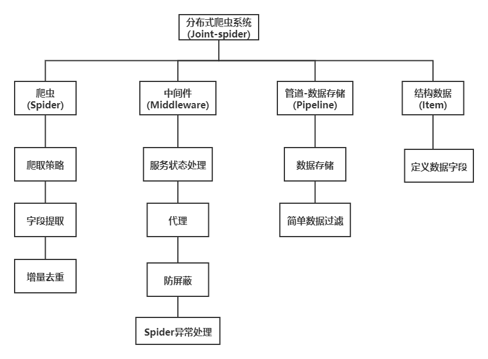
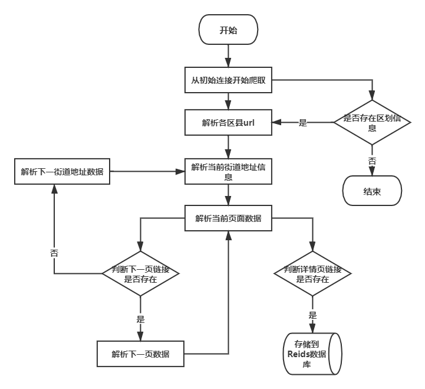

# Joint-spider


<p align="center"></p>

<p align="center">
<a href="https://pypi.python.org/pypi/Scrapy"></a>
<a href="https://pypi.python.org/pypi/Scrapy"></a>
<a href="https://codecov.io/github/scrapy/scrapy?branch=master"></a>
</p>


> 成都贝壳，安居客房源信息爬虫

> 基于 `python` 分布式房源数据爬取系统,为房价数据挖掘及可视化提供数据支持。采用 `Scrapy` 框架来开发，使用 `Xpath` 技术对下载的网页进行提取解析，运用 `Redis` 数据库做分布式，使用Mysql数据库做数据存储，同时保存与`CSV`文件中.

## 应用技术

- Python 网络爬虫技术
  - Requests
  - Scrapy
  - xpath
- Python 文件操作
  - CSV 
  - TXT
- Python 数据库操作技术
  - Mysql
  - Redis

### 项目相关依赖库

- Scrapy==1.6.0
- scrapy-redis==0.6.8
- scrapy-redis-bloomfilter==0.7.0
- PyMySQL==0.9.3
- redis==3.0.1
- requests==2.21.0
- SQLAlchemy==1.3.2
- Twisted==18.9.0


### 环境配置及项目启动

> 整个项目就是基于scrapy-redis的一个分布式项目

```shell
# 环境配置需要 python3.7 redis mysql
# 
# 项目启动
# 1. 运行代理 IPProxy.py
 	 python IPProxy.py # 注意: 既使挑选处理优质代理IP， 但还是存在IP无法工作的问题，
 	 				   # 公开IP极其不稳定，建议花钱
# 2. 部署Master端,进入项目目录\unionSpider\bk_spider\bk\bk下
	 python start.py
# 3. redis数据库插入起始url
	 lpush start_urls https://cd.ke.com/ershoufang/
# 4. 部署worker端,进入项目目录\unionSpider\bk_spider\bk_slave\bk_slave下
	 python start.py
```

### 项目改进

1. 部署至服务器
2. 重构优化代码（代码实在写得太烂了）
3. 优化去重，断点续爬，增量爬取
4. 实现爬虫服务动态更新
5. 增加爬虫运行监控

### 项目注意事项

1.  Redis配置项 进入\unionSpider\bk_spider\bk\bk\utils中修改相关Redis服务配置
2. Mysql配置项 进入 \unionSpider\bk_spider\bk\bk\中直接修改pipline文件中的mysql服务配置


## 项目介绍:


### 一 .  系统功能架构



### 二. 系统分布架构

分布式采用主从结构设置一个Master服务器和多个Worker服务器，Master端管理Redis数据库和分发下载任务，Woker部署Scrapy爬虫提取网页和解析提取数据，最后将解析的数据存储在Mysql数据库中或保存为本地CSV文件。分布式爬虫架构如图所示。


​	应用`Redis`数据库实现分布式抓取，基本思想是`Scrapy`爬虫获取的到的房源详情页的urls都放到`Redis Queue`中，所有爬虫也都从指定的`Redis Queue中`获取urls，`Scrapy-Redis`组件中默认使用`SpiderPriorityQueue`来确定url的先后次序，这是由sorted set实现的一种非FIFO、LIFO方式。因此，待爬队列的共享是爬虫可以部署在其他服务器上完成同一个爬取任务的一个关键点。此外，为了解决Scrapy单机局限的问题，`Scrapy`结合`Scrapy-Redis`进行开发，`Scrapy-Redis`总体思路就是这个工程通过重写`Scrapy`框架中的`scheduler`和`spider`类，实现了调度、`spider`启动和`redis`的交互。实现新的`dupefilter`和`queue`类，达到了判重和调度容器和`redis`的交互，因为每个主机上的爬虫进程都访问同一个redis数据库，所以调度和判重都统一进行统一管理，达到了分布式爬虫的目的。


### 三. 系统实现

**1）爬取策略的设计**

由`scrapy`的结构分析可知，网络爬虫从初始地址开始，根据spider中定义的目标地址获的正则表达式或者`Xpath`获得更多的网页链接，并加入到待下载队列当中，进行去重和排序之后，等待调度器的调度。

在Master端中，链接可以分为四类，分别是

1. 全部房源信息入口页链接,既首页链接`https://cd.ke.com/ershoufang/`
2. 行政区划入口链接，既`https://cd.ke.com/ershoufang/jinjiang/`
3. 房源列表下一页链接,既`https://cd.ke.com/ershoufang/jinjiang/pg2/`
4. 房源详情页链接,既`https://cd.ke.com/ershoufang/106104159569.html?fb_expo_id=306121790391377920`指向的就是实际的房源信息页面。

网络需从首页链接进入，提取到所有区划页链接，解析出所有房源详情页链接,加入到待下载队列准备进一步爬取。流程如下:




在Worker端中，直接进行目标数据解析,主要抓取数据有:

```python
# 房源名称
# 房源总价
# 房源单价
# 小区名字
# 地区,位置
# 户型
# 建筑面积
# 房屋朝向
# 装修情况
# 所在楼层
# 电梯
# 房屋用途 房屋类型
# 挂牌时间 建造年代
# 房源图片
# 房源来源
# 建筑结构
```

爬虫从detail_url进入页面,通过`Xpath`和其他网页结构解析工具抓取相应数据,并保存到MySQL和CSV文件中。


因为采取的分布式主从模式，Master端爬虫主要爬取下载到内容详情页链接，通过redis分享下载任务给其他Woker端的爬虫。Woker端主要是负责对详情页链接的进一步解析提取存储到数据库中。

**2）爬虫的具体实现**

1. 数据抓取程序

